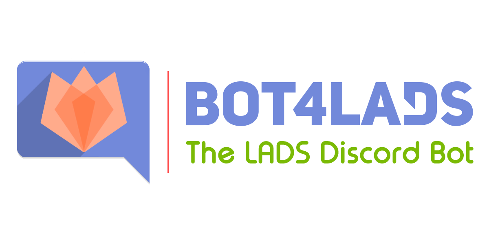

# Bot4LADS

  
  

  

 A Discord Bot fully written in TypeScript for the <strong>LADS</strong> (<em>Laboratório de Análise e Desenvolvimento de Sistemas</em>) of IFPB Campus Campina Grande.

<!-- Table of Contents -->
# Table of Contents <!-- omit in toc -->
- [Bot4LADS](#bot4lads)
- [Author](#author)
- [License](#license)
<!-- -->

<!-- Autor/Contato -->
# Author
* **Guilherme Esdras (guilherme.esdras@outlook.com)** - [GitHub Page](https://github.com/GuilhermeEsdras)
<!-- -->

<!-- Licença -->
# License
*Distributed under the MIT License. See LICENSE for more information.*